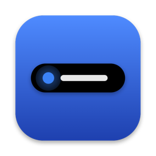
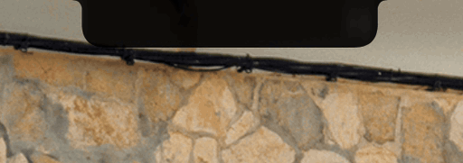

<p align="center">
  
</p>

<h1 align="center">NotchStatus</h1>

<p align="center">
  Shows <a href="https://claude.com/claude-code">Claude Code</a>'s status in your MacBook notch, so you know whether Claude is busy, waiting for you, or done without watching the terminal.
</p>

<p align="center">
  <b>English</b> ｜ <a href="docs/README.zh-TW.md">繁體中文</a>
</p>

<p align="center">
  
</p>

---

## Features

| State | In the notch | When |
|---|---|---|
| Working | Breathing blue dot on the left of the notch, project name on the right | Claude is thinking or running tools |
| Waiting | Notch expands to "⚠ 等你確認 · project" and stays open | Claude needs your permission or an answer |
| Done | "✓ 完成 · project" for 3 seconds, then collapses to a gray dot | The turn has finished |
| Idle | Gray dot and project name | Finished and waiting for your next prompt |

(The on-screen labels are in Traditional Chinese. To change them, edit `SessionState.title` in `NotchStatus/Sources/NotchStatus/NotchView.swift`.)

- **Multiple sessions**: with several Claude Code sessions open, the notch shows the most urgent one (waiting > working > finished). Within the same level, the most recent one wins.
- **Hover list**: move the pointer over the notch to see every session's status.
- **Displays without a notch**: with the lid closed and only an external display connected, a black floating pill below the menu bar takes over.
- **External monitor as the main display**: the status always stays on the built-in notched display, and it moves back there automatically after you plug or unplug displays.
- **Automatic cleanup**: if you close a terminal without ending the session, NotchStatus notices the Claude process is gone and removes that session.
- **Launches at login**, has no Dock icon, never steals focus, and shows over full-screen apps.

## How it works

```
Claude Code hooks ──write──▶ ~/.claude/notch/state/<session_id>.json ──FSEvents──▶ NotchStatus.app
```

1. Claude Code [hooks](https://code.claude.com/docs/en/hooks) run `hooks/state.sh` on each event and write one JSON file per session.
2. NotchStatus.app watches that folder, aggregates the sessions, and draws the result with [DynamicNotchKit](https://github.com/MrKai77/DynamicNotchKit).

The two sides only share a folder, so each can be tested on its own: write a JSON file by hand and the notch reacts.

| Hook event | State written |
|---|---|
| `UserPromptSubmit`, `PostToolUse`, `PostToolUseFailure` | `working` |
| `Notification` (`permission_prompt`, `agent_needs_input`) | `waiting` |
| `Notification` (`idle_prompt`) | `idle` |
| `Stop` | `done` |
| `SessionEnd` | state file deleted |

## Requirements

- macOS 13 or later
- A MacBook with a notch (it also works without one, using the floating pill)
- [Claude Code](https://claude.com/claude-code)
- Xcode Command Line Tools (`xcode-select --install`). **The full Xcode app is not required.**
- `jq` (built into macOS 15 and later; on older versions run `brew install jq`)

## Installation

### 1. Get the source

```bash
git clone https://github.com/pekkachiu/NotchStatus.git
cd NotchStatus
```

### 2. Install the hook script

Symlink `hooks/state.sh` into `~/.claude/notch/`:

```bash
mkdir -p ~/.claude/notch
ln -sf "$PWD/hooks/state.sh" ~/.claude/notch/state.sh
```

> If you move this folder later, run the `ln` command again.

### 3. Add the hooks to Claude Code's settings

This backs up `~/.claude/settings.json`, then **appends** the NotchStatus hooks. Your existing settings and hooks are kept:

```bash
cp ~/.claude/settings.json ~/.claude/settings.json.bak
jq --arg s '$HOME/.claude/notch/state.sh' '
  def h($a): [{hooks: [{type: "command", command: "\($s) \($a)", async: true}]}];
  def m($pat; $a): [{matcher: $pat, hooks: [{type: "command", command: "\($s) \($a)", async: true}]}];
    .hooks.UserPromptSubmit   += h("working")
  | .hooks.PostToolUse        += h("working")
  | .hooks.PostToolUseFailure += h("working")
  | .hooks.Notification       += m("permission_prompt|agent_needs_input"; "waiting") + m("idle_prompt"; "idle")
  | .hooks.Stop               += h("done")
  | .hooks.SessionEnd         += h("end")
' ~/.claude/settings.json.bak > ~/.claude/settings.json
```

> Run this only once; running it again adds duplicate hooks. If `~/.claude/settings.json` doesn't exist yet, create it first with `echo '{}' > ~/.claude/settings.json`.

New Claude Code sessions pick up the hooks. Restart any sessions that are already open.

### 4. Build and install the app

```bash
cd NotchStatus
./build.sh --install
```

This installs `~/Applications/NotchStatus.app` and launches it. If you've moved the app to `/Applications`, later runs update that copy instead. On first launch it registers itself as a login item, so it starts automatically after every login. macOS shows a one-time notification about the new login item.

## Usage

Once installed, there's nothing more to do. Use Claude Code as usual and the notch keeps up with it.

- **See all sessions**: hover over the notch (or the floating pill).
- **Quit for now**: `pkill -x NotchStatus`. To start it again, open NotchStatus from your Applications folder.
- **Stop launching at login**: turn NotchStatus off in System Settings → General → Login Items.

The app has no Dock icon, no menu, and no settings window. Clicking its icon while it's already running does nothing, and that's expected.

## Uninstall

```bash
pkill -x NotchStatus
rm -rf ~/Applications/NotchStatus.app /Applications/NotchStatus.app ~/.claude/notch
```

Then:
1. Remove NotchStatus from System Settings → General → Login Items.
2. Delete every entry under `hooks` in `~/.claude/settings.json` that points to `~/.claude/notch/state.sh`, or restore the `settings.json.bak` made during installation.

## Development

Run these from `NotchStatus/`:

| Command | Purpose |
|---|---|
| `./build.sh` | Build `NotchStatus.app` without installing it |
| `./build.sh --install` | Build, install (updating the copy in `/Applications` if there is one, otherwise `~/Applications`), and relaunch |
| `./test.sh` | Run the Swift tests (`./test.sh --filter AggregatorTests` runs one suite) |
| `../tests/test_state.sh` | Run the hook script tests |
| `./Icon/make-icon.sh` | Regenerate the icon after editing `Icon/draw-icon.swift` |

**Test the UI without Claude Code**: point the app at a scratch folder and write JSON by hand:

```bash
mkdir -p /tmp/notch-test
NOTCH_STATE_DIR=/tmp/notch-test "$PWD/NotchStatus.app/Contents/MacOS/NotchStatus" &
echo '{"state":"waiting","project":"demo","ts":1}' > /tmp/notch-test/a.json
```

Add `NOTCH_FORCE_NO_NOTCH=1` to simulate the floating pill on a notched MacBook. When you're done, `pkill -f "$PWD/NotchStatus.app"` stops only the test copy (`pkill -x` would also stop the installed one).

**Project layout**

```
hooks/state.sh                 Hook script that writes the state files
tests/test_state.sh            Tests for the hook script
NotchStatus/
├── Sources/NotchStatusCore/   Pure logic: parsing, aggregation, presentation (fully tested)
├── Sources/NotchStatus/       App: file watching, notch and pill views
├── Tests/                     Swift Testing tests
├── Vendor/DynamicNotchKit/    Patched DynamicNotchKit (see VENDOR.md)
└── Icon/                      Icon source and .icns
```

**Building with only the Command Line Tools**: the CLT don't include the SwiftUI macro plugins (`@Entry` and `#Preview` won't compile) or XCTest. That's why a patched DynamicNotchKit lives in `Vendor/`, and why the tests use Swift Testing with `test.sh` supplying the framework paths.

See [CLAUDE.md](CLAUDE.md) for design decisions and known issues.

## Known limitations

- The notch shows one session at a time. While another session is still working, a session that just finished won't show its "done" banner (the hover list shows everything).
- Claude Code's `idle_prompt` notification doesn't always fire, so the gray "finished" dot comes from the collapsed "done" state rather than from that notification.
- The `Notification` hook sometimes fires 1–2 seconds after `Stop`, so the status can briefly lag.
- There's no menu to quit the app; use `pkill`.

## Acknowledgements

- [DynamicNotchKit](https://github.com/MrKai77/DynamicNotchKit) (MIT License) by Kai Azim, which provides the notch window. A patched copy lives in `NotchStatus/Vendor/`; see [VENDOR.md](NotchStatus/Vendor/DynamicNotchKit/VENDOR.md) for the changes.

NotchStatus is an independent project and is not affiliated with or endorsed by Anthropic.

## License

[MIT](LICENSE) © pekkachiu
